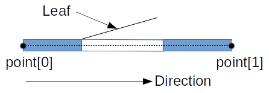

# Intro

#####About the tutorial
The goal of this series of articles is to help beginner programmes to become more mature. There are many books, tutorials, etc. which teach the language, the software design principles, the coding style, and many other aspects of software engineering.
But how to collect all this knowledge together? How to maintain the software when it becomes too complex and it becomes hard to keep ewerything in mind? How can we handle the complexity? How to ensure it is still in a good quality and one change does not break something else?
All that and many more is going to be covered in this tutorial.

The tutorial is focused on designing and development crossplatform GUI application using modern C++ and using modern software design approaches.

Together we will go through many important steps of software development.
The product will be very non ideal at the beginning. But tt will be getting better and better, more and more complex. After some time it might require re-thinking of some aspects, re-designing and refactoring. We will also cover such aspects as build system setup, code quality, automated testing.
Everything like in a real life.

I hope this tutorial will be useful for those who wants to get better undestanding of the *technical* side of software development process.
Why the word "technical" is stressed? Because there is many other sides in software development process: organisational, financial, etc. They are not covered here.

#####What are the expected knowledge to successfully start the tutorial?
It is assumed that the reader has the knowledge is C++ language. Has read a good book about C++ language and **has performed the practical tasks** given in the book.
One of the good books would be the one from the author of C++ language:
[Programming -- Principles and Practice Using C++](http://stroustrup.com/programming.html)

The other important thing - is to be familiar with version gontrol systems. *Git* is a good example of such systems.

So, let's get started.

#What will be implemented?

We will implement GUI application for home and flat design. Such category of application is called CAD ([Computer-aided Design](https://en.wikipedia.org/wiki/Computer-aided_design)).
And for the beginning we could implement something very simple, minimal valuable. Let it be the application, which can design plans only.

At first application iteration we would expect that it will be possible to generate plans like on the picture below:

#Use cases identifying

What shall we start from?

Before we starting coding the application, or even designing its architecture, we need to have better understanding of the wanted use cases.
####What is a use case?
*Use case* - is an action, or a series of actions, performed by user in the system to achieve some goal.
There are many materials about uses cases. One of short and good articles is [here](https://www.usability.gov/how-to-and-tools/methods/use-cases.html).

Now lets enumerate our main scenarios. We are using very informal format of use cases:
1. User creates the empty document.
2. User adds wall to the document.
3. User selects existing wall by clicking on it.
4. User selects multiple walls, by clicking with hold Ctrl key pressed.
5. User edits wall width for the selected walls by editing value in input box.
6. User deletes selected walls by pressing Delete key.
7. User puts window onto the wall. First user clicks on the wall position, where window is placed. Then user specifies widow width by pointing second point by mouse pointer, or typing the window width in input box.
8. User puts the door onto the wall. The approach with the door is the same as with window. But additionally user specifies the door opening direction and specifies whether it is opened ot left or to right side.
9. User can select existing windor or door by clicking on them.
   If user clicks on the door or window - the appropriate wall doesn't get selected if it was not selected before.
10. User edits width for the selected doors or windows.
11. User selects multiple objects - walls, windows and doors.
    Approach for multiselect is the same as in scenario 4.
    Specific object parameters for editing (like wall width or window width are not available in such case).
12. User can delete selected objects by pressing Delete key.
13. User saves document.
14. User closes application.
---
####Now let's go through each use case and describe the steps more detailed:
#####1. User creates the empty document.
Steps:
- User starts operation "new document"
- Blank new document is created and activated
- New document enters into "selecting" state
Note:
- The existing documents should also still be available

#####2. User adds wall to the document.
Steps:
- User starts operation "new wall"
- Document enters into "adding wall" state
- User specifies the start point for wall by *left mouse click*
- Alternatives:
    + User specifies the end point for wall by another *left mouse click*
    + User types wall length by *keyboard* and specifies wall directiion by *left mouse click*
 - User types the wall width by *keyboard*.
     + User could skip width typing by pressing *Enter* key, or by *left mouse click*. In that case the default wall width will be used.
     + Default wall width is the same as width which was used in previous wall.
     + For the very first wall the default width is 200mm
- New wall is added to the document
- Document enters into "selecting" state
 Note:
 - At any timepoint user can cancel "adding wall" operation. In that case the wall is not added to the document. Document returns to "selecting" state.

#####3. User selects existing object by clicking on it.
Prerequisites:
- Document is in "selecting" state.
Steps:
- User clicks onto the existing object (wall, window, door) in the document.
- The clicked object becomes "selected" state
- The other objects, which were previously selected, become "normal" state

**!!! Note**:
Formal use cases can be much more detailed. But such work on use cases is out of scope for this tutorial.

---
####The outcomes from the use cases description
Use cases give us good understanding of how the application should behave.

And now it is possible to get systematic information about some application behavior aspects:
&nbsp;
1. Application should perform operations:
    - New document
    - New wall
&nbsp;
2. Document might be in different states:
    - Selecting
    - Adding wall
    - Adding window
    - Adding door
&nbsp;
3. Document consists of the following objects:
    - Wall
    - Window
    - Door
&nbsp;
4. Object (wall, window, door) might be in one of states:
    - Normal
    - Selected
     
#Interface design

As soon as we are developing GUI application - our interface is a graphic user interface (unlike in case of web service or a library, where the interface is an API)

The main window could look like:

There are 4 main areas in main window:
1. Main Menu. All application functions should be available in there.
2. Document Tabs. It is for switching between opened documents.
3. Working Area. The main area, where interactive plan is rendered and where user can edit the plan.
4. Options Area. The auxiliary area, where some additional controls are shown. For example - an input box for wall width when wall is added or edited.

####Main Menu

Let's start from just one menu item in Main Menu - File, which is quite standard and contains all the major options to operate with documents on the file system.

####Working Area && Options Area

The picture below demonstrates how could look the plan with 4 walls and 2 windows. One of windows is selected.
The options area shows the width of the selected window.

#Architecture

The detailed architecture design is also out of scope of this tutorial.
We will use minimal design, which will give the uderstanding what layers are necessary and what components should be implemented. We also need to design main relations between components.

###Layers

We will use typical 3-layered architecture.
There are many good resources, which describe this archiecture. For example here is one of them: [Software Architecture is Layers of Goodness](https://www.originalcoder.dev/2019/07/27/software-architecture-is-layers-of-goodness/)

#####Presentation
Tha layer, which is responsible for presenting information to user and intercation with user. I.e. that is GUI and all the code, which is related to GUI.

#####Service
The layer, which encapsulates all the business logic inside, the engineering calculations, validations, etc.

#####Persistence
The layer, which is responsible for store and load the data to the storage. In our our case the storage is the filesystem.

And here are  also 2 additional cross-layered items shown:

#####Common
It will contain all the low-level, common library code, which could be re-used at any layer.

#####Domain
It will contain components for business data representation. In our case there will be the object representation for the plan.

Not it is time to design layers more detailed.

###Domain Layer

We are starting from the domain layer. Lets make it as simple as possible at the beginning. We will extend it and will make more and more complex later when it will be necessary.

First, we need to enumerate the entityes which will be presenting the plan.

To enumerate the entities, let's think, what is presented on the plan.  Looking through the use cases we could identify the following elements: walls, windows, doors.

So, our entities are:
1. Wall
2. Window
3. Door

Now let's look deeper at each entity and let's see what attributes are necessary for each of them:

#####Wall
Wall needs to be located on the plan somehow. How can it be done?
Actually there are many options. But for now let's choose the one which is very simple: by 2 coordinates of 2 points.
So, wall requires the coordinates of the 2 points: `start point` and `end point`. Each point needs 2 coordinates: `x` and `y`.
Looking at the use cases we could also notice that wall requires `width` to be specified. So, we are also adding this attribute.

Now the set of attributes for `wall` is:
- start point : point
- end point : point
- width : real

The text after the column describes the type of the attribute.

At this moment we could notice that logically there is no difference between `start point` and `end point`. Any of 2 points could be either start or end. It does not matter.

Havig that fact, let's combine start and end point into a collection of 2 points.

So, the attributes could be:
- points : point[2]
- width : real

And now we are ready to present the class diagram for `Wall` entity:

Diagram uses [UML](https://en.wikipedia.org/wiki/Unified_Modeling_Language) notation. There are many books and internet resources, which describe UML in details.
E.g. here is a short article about class diagrams: [UML 2 Class Diagrams](http://www.agilemodeling.com/artifacts/classDiagram.htm) 

#####Window
Window needs also to be located. How can we locate window?
We could go with the same approach which was used for wall location: by 2 points.

But it does not seem the best one here actually. Having the fact that window can be located on the wall only, we could think how we can re-use the wall coordinates.
What if we specify the reference to the  wall, which the window belongs to, and we will specify the distance from the wall's point #0? Let's call that attribute `offset`.
Doing that way we could specify one of window's points. To specify the 2nd - we can simply use the distance from the 1st one. Let's call that distance `width`. It sounds more natural for such window parameter.

That option is better than specifying separeate 2 points because of 2 reasons:
1. It is not possible now to make a mistake and place the window out of the wall.
    *Note: Actually, it is possible, if the `offset` will be negative, or will be longer that the wall length. But anyway such variant is safer that having 2 independent points*
 2. Domain model now better reflects the real world picture: windows exist only in walls.
 
 The diagram:
 
 
#####Door
Obviously the door should be located in the same way as the window is located. We will use the same attributes as the ones for window.

But the door is more complicated entity. It reqires more attributes to be specified:
1. Door could be opening inside or outside, or even to both sides:
 
 &nbsp;
 &nbsp;
2. Door could be opening to the left side or to the right side:

&nbsp;
&nbsp;
3. And the door even could be split and be opened to the left and the right simultaneously:

&nbsp;

For sure, there is much more options how the door could be presented. But according to use cases that is all, what we need to support for now.

Let's summarize the findings:
1. The door could have 1 or 2 leafs;
2. Each leaf could have `width` less or equal than the door's `width`;
3. Summary leaf's widths should be equal to the door's width;
4. There is 4 variants how the leaf can be opening: (inside or outside opening) x (left or right opening);

#####Leaf
How could the leaf be formally defined?

The criterias defiend above: opening inside or outside, opening to the left or to the right - they are very clear for human, because the room context is known.
But from formal perspective - there in no room context in our formal model (Remark: there is no such context yet, we might need it later).

So, let's think what is already awailable from the formal perspective:
There is available so called **wall direction** - the direction from point[0] to point[1] onward the wall:

&nbsp;

Now how we could define if the leaf is "left" or "right" in context of the wall direction? First of all, the definition "left/right" is very subjective - it even depends on the side, which we are looking at the door from. So, we need something else. More formal.

Let's assume that the leaf's orientation is `forward` if it opens according to the wall direction. And the orientation is `backward` if the leaf opens counter the wall direction:

&nbsp;

What bout "inside/outside opening" criteria?
As it was said above, for now in the model there is no information of where is "inside" and where is "otside". So, such  distingushing does not suit for us well.

But looking the the leaf from the door direction perspective, we cold see that the leaf could be opened either to the left direction, or to the right direction. And this could be formally defined:

&nbsp;

So, the combination of 3 parameters:
1. Leaf orientation: froward or backward
2. Leaf direction: left or right
3. Leaf width

Gives us the complete invariant of the leaf formal definition.

Now we are ready to have the class diagram for the door and the leaf:

The link "contains" expresses that 1 door could contain from 0 to 2 leafs.

#####Domain model diagram
And now we are ready to show the whole domain model:

Some more changes are made here:
1. The "root" entity - Document is introduced. It contains many walls.
2. Point is extracted frow Wall into the separate entity.
3. Attributes links to Wall from Window and from Door are not shown explicitly. They are replaced with "contains" relations.

###Presentation Layer

Now let's move to GUI design.

GUI consists of a single window - Main Window.
Main Window should be logically split into a set of loosely coupled [widgets](https://en.wikipedia.org/wiki/Graphical_widget)

Looking at the User Interface section, we could easily get high-level widgets breakdown:

`MainWindow`, `MainMenu`, `WorkingArea`, `DocumentTabs` are pretty straightforward. And for now it looks like they could be implemented based on standard widgets, which are available in any mature GUI library.
For sure they will require some coding, but  for now we could assume there is not expected something worth more detailed design at the architecture design stage.

But `Editor` and `OptionsBar` are more complicted. Let's see why. And let's think about their design in more details.

#####Editor

Editor performs following functions:
1. Render the domain objects (walls, windows, doors) according to their attributes.
2. Should support a few states: "object creation", "object selection".
3. In "object creation" state should do:
    3.1 Render the object which is being created according to its state even though it is already not completed
    3.2 Immediately re-render the object if its properties are updated through `OptionsBar`
